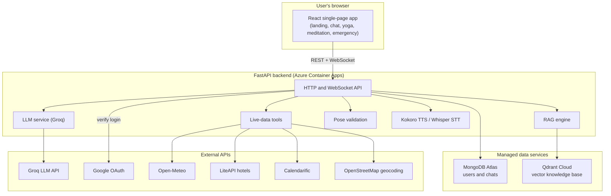
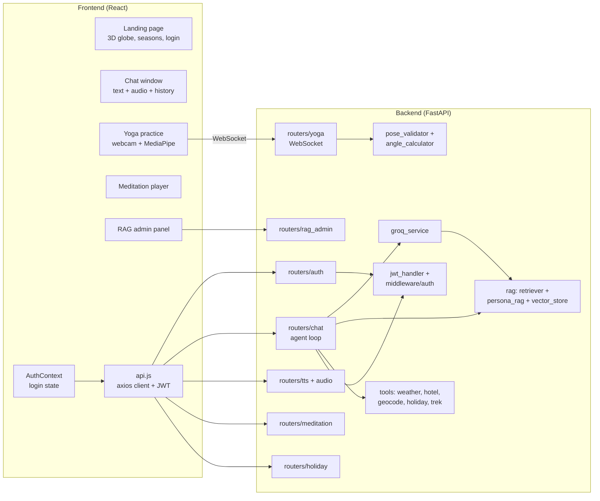
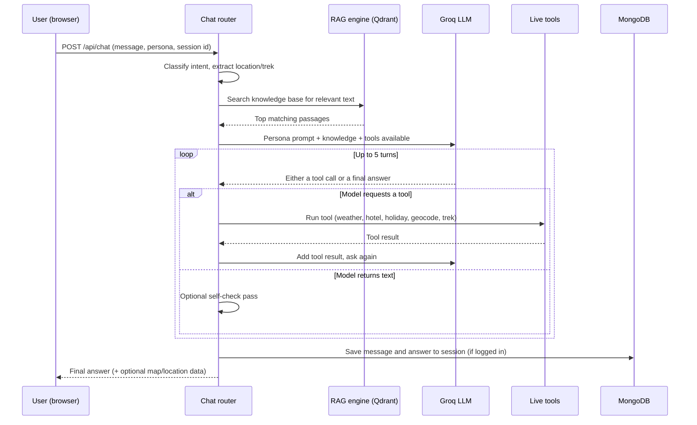
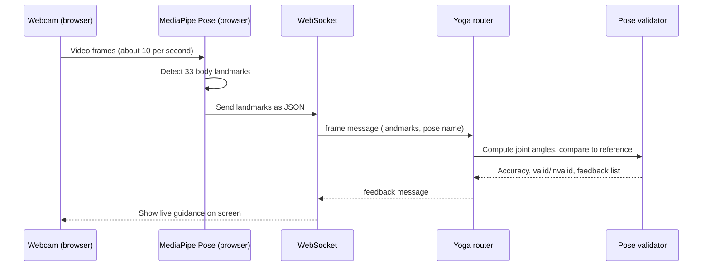
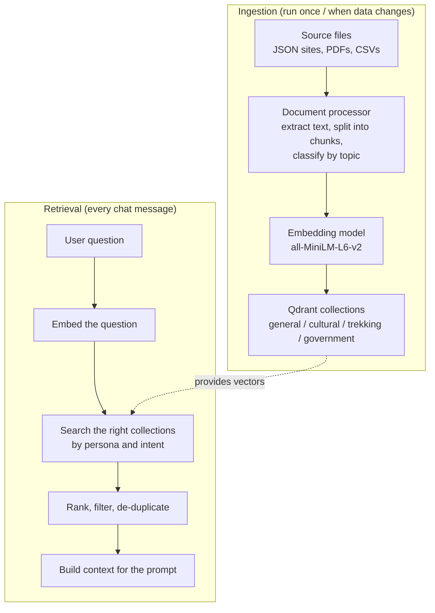
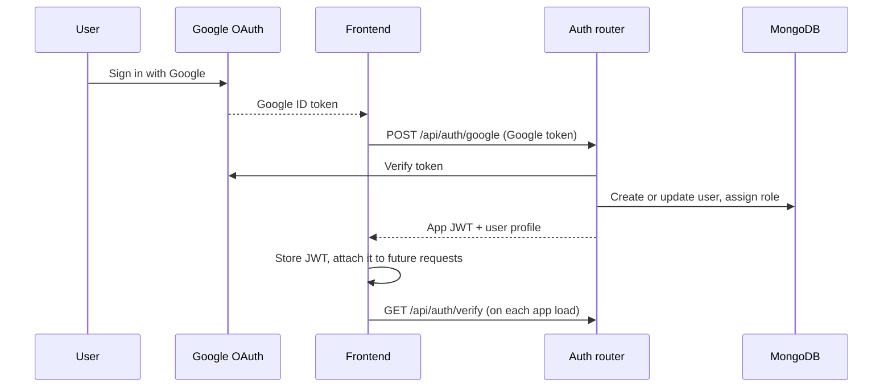

# Deep Shiva

Deep Shiva is an AI-powered tourism assistant for India. It helps travellers plan spiritually and culturally rich trips by combining a chat assistant, a knowledge base of Indian sites and traditions, live travel data (weather, hotels, holidays, treks), guided meditation audio, and a camera-based yoga posture checker.

This project won 1st place in an All-India hackathon.

The rest of this document explains, in plain language, what the system is made of, how the pieces fit together, and how data moves through it. Diagrams are written in Mermaid and render automatically on GitHub.

---

## Table of contents

1. [What it does](#1-what-it-does)
2. [Technology stack](#2-technology-stack)
3. [High-level architecture](#3-high-level-architecture)
4. [Component map](#4-component-map)
5. [How a chat message is answered](#5-how-a-chat-message-is-answered)
6. [How the yoga camera feature works](#6-how-the-yoga-camera-feature-works)
7. [How knowledge flows into the system (RAG)](#7-how-knowledge-flows-into-the-system-rag)
8. [Authentication flow](#8-authentication-flow)
9. [Project structure](#9-project-structure)
10. [Backend modules explained](#10-backend-modules-explained)
11. [Frontend modules explained](#11-frontend-modules-explained)
12. [Knowledge base and data](#12-knowledge-base-and-data)
13. [API endpoints](#13-api-endpoints)
14. [Environment variables](#14-environment-variables)
15. [Running locally](#15-running-locally)
16. [Data ingestion](#16-data-ingestion)
17. [Deployment](#17-deployment)
18. [Notes and current limitations](#18-notes-and-current-limitations)

---

## 1. What it does

In simple terms, a user opens the website, optionally signs in with Google, and can:

- **Chat with a travel guide** that answers in one of several personas (for example a spiritual guide or a practical trip planner). The assistant pulls facts from a curated knowledge base about Indian temples, festivals, cuisines, treks, and culture, and it can also call live tools to fetch current weather, hotel prices, public holidays, and trek information.
- **Talk instead of type.** The user can record audio; the backend transcribes it (English or Hindi/Hinglish) and answers as if it were typed.
- **Keep a chat history.** Conversations are saved per user as sessions that can be renamed, deleted, summarised by AI, and exported to PDF.
- **Listen to guided meditation** with text-to-speech narration and background music.
- **Practise yoga in front of a webcam.** The browser detects body landmarks, streams them to the backend, and the backend scores the pose against reference angles and gives live feedback.
- **Look up emergency information** (national and state helplines) on a dedicated page.

---

## 2. Technology stack

**Backend**
- FastAPI (Python 3.11), served by Uvicorn.
- Large language model through the Groq API. Default model is `meta-llama/llama-4-scout-17b-16e-instruct`, configurable with the `GROQ_MODEL` variable. An offline fallback using a local quantized model (`Llama-3.2-1B-Instruct` via `llama_cpp`) exists in code for development; the production image is built without it.
- Vector database: Qdrant Cloud. Text is turned into embeddings with the `all-MiniLM-L6-v2` model (384 dimensions). Four collections are used: `india_general`, `india_cultural`, `india_trekking`, `india_government`.
- MongoDB (via the async Motor driver) for user accounts and chat history.
- Authentication: Google OAuth 2.0, with a backend-issued JWT (HS256).
- Text-to-speech: Kokoro. Speech-to-text: faster-whisper.
- Live-data tools: Open-Meteo (weather), Nominatim/OpenStreetMap (geocoding), LiteAPI (hotels), Calendarific (holidays), a Kaggle dataset (treks).
- PDF generation: ReportLab.

**Frontend**
- React 18 with Vite.
- Styling with TailwindCSS and custom CSS.
- 3D landing page with three.js and react-three-fiber, animations with Framer Motion.
- Maps with Leaflet and react-leaflet.
- Camera and pose detection with react-webcam and MediaPipe Pose.
- Markdown rendering for chat answers with react-markdown.

**Infrastructure**
- Backend packaged as a Docker image, pushed to GitHub Container Registry, deployed to Azure Container Apps by a GitHub Actions workflow.
- Frontend deployed to Vercel.

---

## 3. High-level architecture

This is the big picture: a browser app talks to one backend service, and that backend talks to several managed cloud services and public APIs.



**In plain language:** the browser is the only thing the user sees. Everything intelligent happens in the backend. The backend stores user data in MongoDB, stores its searchable knowledge in Qdrant, and reaches out to Groq for the actual language model and to a handful of public APIs when the user asks for live information.

---

## 4. Component map

This shows the main building blocks inside the frontend and the backend, grouped by responsibility.



**In plain language:** on the frontend, `api.js` is the single place that talks to the backend over HTTP and attaches the login token. The yoga feature is special because it uses a live WebSocket connection instead of normal requests. On the backend, each router is one feature area. The chat router is the most complex one: it coordinates the language model, the knowledge base, and the live tools to produce an answer.

---

## 5. How a chat message is answered

This is the core flow. When a user sends a message, the chat router runs an "agent loop": it asks the language model what to do, lets it call tools if needed, feeds the results back, and repeats until the model produces a final answer.



**In plain language:** the backend does not just forward the user's text to the language model. First it figures out what the user is asking about and pulls related facts from the knowledge base. Then it gives the model both the question and those facts, plus a list of tools it is allowed to use. If the model decides it needs live data (say, today's weather in Rishikesh), it asks for the weather tool, the backend runs it, and hands the result back to the model. This can repeat a few times until the model has everything it needs to write a final answer. Logged-in users have the conversation saved so they can return to it later.

---

## 6. How the yoga camera feature works

The pose detection runs in the browser; the backend only scores the result. This keeps video off the network and only sends small numeric landmark data.



**In plain language:** the camera feed never leaves the user's computer. The browser uses MediaPipe to find the positions of the body's joints and sends only those coordinates to the backend. The backend calculates the angles of the elbows, shoulders, knees, and hips, compares them to the ideal angles stored for each pose, and sends back a score and short tips like "straighten your left arm." Because this happens many times per second, a live WebSocket connection is used instead of normal one-off requests.

---

## 7. How knowledge flows into the system (RAG)

RAG means Retrieval-Augmented Generation: before the model answers, the system retrieves relevant facts and gives them to the model. There are two phases: loading data in (ingestion), and looking data up (retrieval).



**In plain language:** all the knowledge (temple descriptions, festivals, treks, government tourism documents, and so on) is first broken into small pieces of text. Each piece is converted into a list of numbers (an embedding) that captures its meaning, and stored in Qdrant. When a user asks something, the question is converted the same way, and Qdrant finds the stored pieces whose meaning is closest to the question. Those pieces are then handed to the language model as background so it can answer with real facts instead of guessing.

The knowledge is split into four topic collections so the system can search the most relevant area first. Different personas prefer different collections (for example, a spiritual guide leans on the cultural collection, a trekking guide on the trekking collection).

---

## 8. Authentication flow

Login uses Google. The backend verifies the Google token, creates or updates the user in MongoDB, and issues its own JWT that the frontend uses for later requests.



**In plain language:** the user signs in with their Google account. Google confirms who they are and hands a token to the frontend. The frontend passes that to the backend, which checks it with Google, records the user, and gives back its own token. From then on, every request the frontend makes carries that token so the backend knows who is asking. Some accounts can be marked as admins (by listing their email in configuration), which unlocks the knowledge-base management endpoints.

---

## 9. Project structure

```
DeepShiva-tourism/
  backend/
    main.py                 Application entry point, CORS, static files, router wiring
    config.py               Environment-driven settings and production checks
    routers/                One file per feature area (auth, chat, yoga, tts, etc.)
    rag/                    Retrieval pipeline (vector store, retriever, persona logic)
    tools/                  Live-data tools the chat agent can call
    utils/                  JWT, database, audio, TTS, PDF, pose math, prompts
    localmodel/             Optional offline LLM (development only)
    models/                 Pydantic data models for users and chats
    middleware/             Auth dependencies
    scripts/                Data ingestion and maintenance utilities
    data/                   Knowledge base (JSON, PDFs, CSVs) and meditation content
    pose_data/              Reference joint angles for yoga poses
    public/                 Audio and image assets
    Dockerfile              Production image build
  frontend/
    src/
      main.jsx              App bootstrap and routes
      App.jsx               Chat screen layout
      api.js                Axios client and all REST calls
      context/              Auth and theme React contexts
      hooks/                Reusable logic (yoga, meditation, holidays, export)
      components/           Chat, yoga, meditation, admin, and shared UI
      landingPage/          3D landing page
      emergencyPage.jsx     Emergency helplines page
    vite.config.js          Build configuration
  .github/workflows/        CI/CD pipeline for the backend
  DEPLOY.md                 Deployment notes
```

---

## 10. Backend modules explained

- **`main.py`** builds the FastAPI app, sets up cross-origin rules, mounts static files (images, audio, yoga images) with safe path handling, connects to MongoDB on startup, and registers every router under the `/api` prefix.
- **`config.py`** reads all settings from environment variables and refuses to start in production if critical secrets are missing.
- **`routers/auth.py`** handles Google login, issues JWTs, and exposes identity endpoints (`verify`, `me`, `logout`, `admin-check`).
- **`routers/chat.py`** is the heart of the assistant: it runs the agent loop described in section 5, manages chat sessions (create, list, rename, delete), generates AI summaries, and exports conversations to PDF.
- **`routers/yoga.py`** exposes the WebSocket used for live pose feedback plus REST endpoints to list poses and analyse a single set of landmarks.
- **`routers/tts.py`** streams synthesised speech using Kokoro. **`routers/audio.py`** accepts an audio upload, transcribes it with Whisper, and routes the text through the chat logic.
- **`routers/meditation.py`** serves guided-meditation courses and chapters from JSON files.
- **`routers/holiday.py`** returns Indian public holidays. **`routers/persona.py`** returns the list of available chat personas. **`routers/mock_data.py`** serves static sample data (weather, crowd, festivals, emergency).
- **`routers/rag_admin.py`** lets administrators add content to the knowledge base (PDFs, web pages, raw text), inspect collection statistics, and test searches.
- **`rag/vector_store.py`** wraps Qdrant: it loads the embedding model, creates the four collections, and handles adding, querying, and deleting documents.
- **`rag/retriever.py`** searches across collections based on persona and intent, then ranks and de-duplicates results. **`rag/persona_rag.py`** turns those results into a context block sized for the prompt. **`rag/document_processor.py`** and **`rag/content_manager.py`** handle extracting, chunking, classifying, and registering source documents.
- **`tools/`** contains the live-data tools (weather, geocoding, hotels, treks, holidays) and their definitions. **`utils/groq_service.py`** builds the persona prompt, calls Groq, and manages tool calls.
- **`utils/`** also holds JWT handling, the MongoDB connection, audio processing, Kokoro TTS, ReportLab PDF generation, intent classification, and the pose math (`angle_calculator.py`, `pose_validator.py`).
- **`localmodel/`** provides an optional local language model for offline development.

---

## 11. Frontend modules explained

- **`main.jsx`** sets up the Google OAuth provider, the auth and theme contexts, and three routes: `/` (landing), `/chat` (main app), and `/emergency`.
- **`api.js`** is the single axios client. It reads the backend URL from `VITE_API_BASE_URL` and automatically attaches the stored JWT to every request.
- **`context/AuthContext.jsx`** holds login state, verifies the token on load, and exposes login and logout. **`context/ThemeContext.jsx`** holds light/dark mode.
- **`components/ChatWindow.jsx`** renders the conversation, handles sending text and recording audio, and switches personas. **`components/MessageBubble.jsx`** renders each message (markdown for the assistant, with an optional embedded map and browser text-to-speech). **`components/ChatHistorySidebar.jsx`** lists saved sessions with rename, delete, summarise, and PDF export.
- **`components/YogaPractice.jsx`** with **`hooks/useYoga.js`** runs the webcam, loads MediaPipe Pose, and streams landmarks over the WebSocket.
- **`components/MeditationPlayer.jsx`** and **`hooks/useMeditation.js`** play guided sessions, fetching narration from the TTS endpoint and looping background music.
- **`components/admin/`** is the React panel for managing the knowledge base (upload, statistics, search testing).
- **`landingPage/`** holds the 3D globe (`Earth3D.jsx`, `SeasonToggle.jsx`), the seasonal animation layers, and the login panel.
- **`emergencyPage.jsx`** is a static page of national and state helpline numbers.

---

## 12. Knowledge base and data

The knowledge lives under `backend/data/` and falls into a few groups:

- **Site files (`data/json_content/`)** describe religious and cultural sites, organised as a matrix of religion (Hinduism, Islam, Jainism, Buddhism, Christianity, Sikhism) by region (North, South, East, West, Central), plus several state-specific files. Each site record includes its name, type, significance, location with coordinates, and sources.
- **Themed files** in the same folder cover festivals, shlokas, treks, cuisines, crowd patterns, emergency information, eco tips, and wellness routines. These are richer, traveller-facing records with quick summaries and cross-references.
- **Spiritual corpus (`data/spiritual/`)** is a set of PDFs and CSVs: religious texts, yoga and wellness material, and Indian Ministry of Tourism strategy and reference documents. These are the unstructured source for the knowledge base.
- **Meditation (`data/meditation/`)** holds courses and chapter scripts (segments of narration with pauses) for the meditation player.
- **Pose data (`pose_data/reference_poses.json`)** holds the ideal joint angles and tolerances for each yoga pose used by the validator.

All of this text is processed into the four Qdrant collections so it can be searched during chat.

---

## 13. API endpoints

General:
- `GET /` service information.
- `GET /health` health check.
- `GET /docs` interactive Swagger documentation.

Authentication (`/api/auth`):
- `POST /api/auth/google` log in with a Google token.
- `GET /api/auth/verify`, `GET /api/auth/me`, `POST /api/auth/logout`, `GET /api/auth/admin-check`.

Chat (`/api`):
- `POST /api/chat` send a message and get an answer.
- `POST /api/chat/audio` send audio, get transcription and answer.
- `POST /api/chat/sessions/new`, `GET /api/chat/sessions`, `GET /api/chat/sessions/{id}`.
- `PUT /api/chat/sessions/{id}/title`, `DELETE /api/chat/sessions/{id}`.
- `GET /api/chat/sessions/{id}/export/pdf`, `POST` and `GET /api/chat/sessions/{id}/summary`, `GET /api/chat/sessions/{id}/summary/pdf`.
- `GET /api/connection-status`.

Personas, meditation, holidays:
- `GET /api/personas`.
- `GET /api/meditation/courses`, `GET /api/meditation/courses/{id}`, `GET /api/meditation/courses/{id}/chapters/{id}`.
- `GET /api/holidays/upcoming`, `GET /api/holidays/year/{year}`.

Speech:
- `GET /api/tts/kokoro` stream synthesised speech, `GET /api/tts/status`.

Yoga (`/api/yoga`):
- `WS /api/yoga/ws` live pose feedback.
- `POST /api/yoga/analyze-landmarks`, `GET /api/yoga/poses`, `GET /api/yoga/poses/{name}`, `GET /api/yoga/health`.

Knowledge-base administration (`/api/rag`, admin only for write operations):
- `POST /api/rag/upload-pdf`, `POST /api/rag/add-webpage`, `POST /api/rag/add-text-content`, `POST /api/rag/batch-process`.
- `GET /api/rag/content-stats`, `GET /api/rag/collections`, `POST /api/rag/test-search`, `DELETE /api/rag/remove-content`, `DELETE /api/rag/clear-collection`.

---

## 14. Environment variables

Create a `.env` file inside `backend/`:

```
ENV=development
MONGODB_URI=mongodb://localhost:27017/deepshiva_tourism
DATABASE_NAME=deepshiva_tourism

JWT_SECRET_KEY=replace-with-a-strong-random-string-at-least-32-chars
JWT_ALGORITHM=HS256
JWT_EXPIRY_HOURS=168

GOOGLE_CLIENT_ID=your-google-client-id
GOOGLE_CLIENT_SECRET=your-google-client-secret
ADMIN_EMAILS=you@example.com

GROQ_API_KEY=your-groq-key
GROQ_MODEL=meta-llama/llama-4-scout-17b-16e-instruct

QDRANT_HOST=https://your-qdrant-cluster-url
QDRANT_API_KEY=your-qdrant-key
QDRANT_DIM=384

FRONTEND_URL=http://localhost:5173
ALLOWED_ORIGINS=http://localhost:5173,http://localhost:3000

# Optional, only needed for specific tools
LITEAPI_KEY=
CALLENDRIFIC_API_KEY=
KAGGLE_USERNAME=
KAGGLE_KEY=
GROQ_API_KEY2=
```

Create a `.env` file inside `frontend/`:

```
VITE_API_BASE_URL=http://localhost:8000/api
VITE_GOOGLE_CLIENT_ID=your-google-client-id
```

Note: use a real, long random value for `JWT_SECRET_KEY`. In production (`ENV=production`) the backend will refuse to start unless `JWT_SECRET_KEY`, `GOOGLE_CLIENT_ID`, `GROQ_API_KEY`, and `QDRANT_HOST` are all set.

---

## 15. Running locally

Prerequisites: Python 3.11, Node.js and npm, a MongoDB instance, and access to a Qdrant Cloud cluster (with credentials in the backend `.env`).

Backend:

```
cd backend
python -m venv .venv

# Windows
.venv\Scripts\activate
# Linux or macOS
source .venv/bin/activate

pip install -r requirements.txt
uvicorn main:app --reload --host 0.0.0.0 --port 8000
```

Frontend:

```
cd frontend
npm install
npm run dev
```

The frontend runs at `http://localhost:5173` and the backend at `http://localhost:8000`.

---

## 16. Data ingestion

Before chat can use the knowledge base, the source data must be embedded into Qdrant. Make sure the backend `.env` has valid Qdrant credentials, then run from the `backend/` directory:

```
python scripts/clean_ingest.py
```

`clean_ingest.py` clears the existing `india_*` collections and rebuilds them from scratch, which avoids duplicate entries on re-runs. Other scripts in `scripts/` exist for partial or specialised ingestion and maintenance.

---

## 17. Deployment

- **Backend.** The `Dockerfile` builds a CPU-only image (multi-stage, runs as a non-root user, includes a health check). The GitHub Actions workflow in `.github/workflows/deploy-backend.yml` builds and pushes the image to GitHub Container Registry on every push to `master` that touches `backend/`, then updates the Azure Container App if Azure credentials are configured. Secrets are supplied as Azure Container App secrets. See `DEPLOY.md` for the full procedure.
- **Frontend.** Built with Vite and deployed to Vercel. Set `VITE_API_BASE_URL` to the deployed backend URL and `VITE_GOOGLE_CLIENT_ID` to your Google client id in the Vercel project settings.

---

## 18. Notes and current limitations

- The vector database in current deployments is Qdrant Cloud. An older local ChromaDB mode is referenced in some scripts and comments but is no longer the active path; `clean_ingest.py` is the reliable ingestion route.
- The local offline language model (`llama_cpp` GGUF) is intended for development and is excluded from the production image, which relies on the Groq API.
- Several tools depend on external API keys (LiteAPI, Calendarific, Kaggle). Without them, those specific features return errors while the rest of the app continues to work.
- The yoga feature loads MediaPipe Pose from a content delivery network at runtime, so it requires internet access in the browser.
- The repository does not include an open-source LICENSE file.
